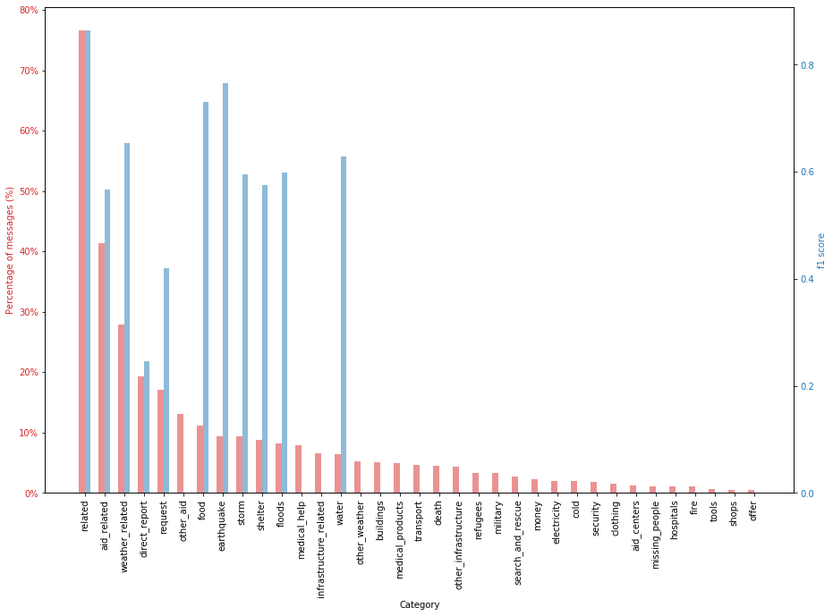

# Project_Disaster_Response
This project consists of a disaster response web-app. It is part of the Udacity's Data Science Nanodegree. 

### Table of Contents

1. [Project Motivation](#motivation)
2. [Installation](#installation)
3. [File Descriptions](#files)
4. [Instructions](#instructions)
5. [Results](#results)
6. [Licensing, Authors, and Acknowledgements](#licensing)

## Project Motivation

The goal of the project is to build a model for an API that classifies disaster messages. It includes a web app where an emergency worker can input a new message and get classification results in several categories. 

The motivation behind the project is to showcase my recently acquired software skills, including the ability to create basic data pipelines and write clean, organized code. 

## Installation 

The code should run using any Python versions 3.*.. The following libraries are required:
* [plotly](https://plotly.com/)
* [flask](https://flask.palletsprojects.com/en/1.1.x/)
* [pandas](https://pandas.pydata.org/)
* [nltk](nltk.org)
* [sklearn](https://scikit-learn.org/stable/)
* [sqlalchemy](https://www.sqlalchemy.org/)

If running the web app (run.py file), a virtual environment is recommended. Please follow [these straightfoward instructions](https://pythonforundergradengineers.com/new-virtual-environment-with-conda.html) if using the Anaconda Package. Python's [official documentation](https://docs.python.org/3/tutorial/venv.html) can be quite helpful too.

## File Descriptions 

The relevant data is found under the `disaster_response_pipeline_project` folder. There are three sub-folders:

`data` 

> `disaster_messages.csv` - Dataset containing roughly 26,000 messages drawn from events including an earthquake in Haiti in 2010, an earthquake in Chile in 2010, floods in Pakistan in 2010, super-storm Sandy in the U.S.A. in 2012, and news articles spanning a large number of years and 100s of different disasters. Messages are written in English and in their original language. Furthermore, the dataset includes the type of the messag ("genre"): direct, news or social.
    
> `disaster_categories.csv` - The previous data has been encoded with 36 different categories related to disaster response.
    
> `process_data.py`- ETL (Extract, Transform, Load) Pipeline. It combines the aforementioned files, cleansthe data and loads it into a Database file.

`models`

>`train_classifier.py` - NPL (Natural Language Processing) Pipeline. It loads the data from the database created by `process_data.py`, and builds, trains, evaluates and saves a SGDClassifier Machine Learning Model.  

`app`

>`templates` - here you will find the HTML Templates of the web app, provided by Udacity.
    
>`run.py` - this file is the backend of our Flask-based webapp. It contains data visualizations, and uses the machine learning model pickled by `train_classifier.py` to predict categories of new data.
    
## Instructions 

After cloning this repository, open your terminal. Go to the project's `disaster_response_pipeline_project` directory and type in the following commands:  

1. First, run the ETL Pipeline `process_data.py`. It takes in three arguments: the two csv files' paths, and the desired database path.

        `python data/process_data.py data/disaster_messages.csv data/disaster_categories.csv data/DisasterResponse.db`

2. Then, run the NLP Pipeline `train_classifier.py`. It takes two arguments: the path of the database to train/test on, and the desired pickle file path. This step might take some minutes, depending on your machine.

        `python models/train_classifier.py data/DisasterResponse.db models/classifier.pkl`

3. Run the following command in the app's directory to run your web app. I recommend using a virtual enviroment.

        `python run.py`

4. Open http://localhost:3001/ on your browser.

4. Have fun!

## Results

In order to correctly classify the disaster-relevant messages, a SGD Classifier algorithm was used. Linear Support Vector Machine is widely regarded as one of the best text classification algorithms (see [here](https://towardsdatascience.com/multi-class-text-classification-model-comparison-and-selection-5eb0661975689)).

However, the exploration of the dataset revealed its imbalance. More than half of the categories have comparatively small (<5% of the messages) representation in the dataset. One category (child_alone) did not have any example sentence, and was therefore removed.

Even though the Machine Learning Model has a good accuracy (94.1%), its results are rather "naive". As we see in the figure below, more than half of the 35 categories have a zero f1 score - those are majoritarily the categories with less than 5% message representation.

There is also indication of mislabeling. For instance, there were roughly 1300 messages where the word "water" is present, but it is not labeled as water-relevant. As a consequence, the model may not react well to new data. For instance, typing in a simple sentence such as "I am thristy" in the webapp does not return the expected output.

Some [approaches](https://towardsdatascience.com/handling-imbalanced-datasets-in-machine-learning-7a0e84220f28) could improve the model, such as over/undersampling, or relabeling/recollecting data. Hopefully, I will have time to dig into these solutions in the future.

## Licensing, Authors, Acknowledgements

Must give credit to Appen for the disaster datasets. You can find them [here](https://appen.com/datasets/combined-disaster-response-data/).

Udacity's Data Science Nanodegree provided the Flask Web App Template. You can find more information [here](https://www.udacity.com/course/data-scientist-nanodegree--nd025).

