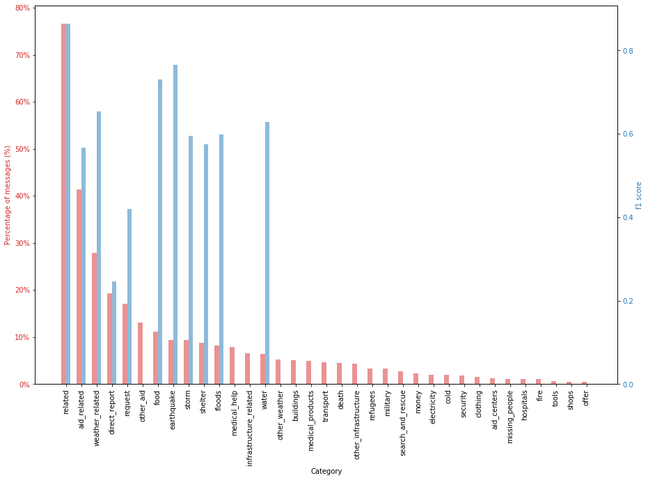

# Project_Disaster_Response
This project consists of a disaster response web-app. It is part of the Udacity's Data Science Nanodegree. 

### Table of Contents

1. [Project Motivation](#motivation)
2. [Installation](#installation)
3. [File Descriptions](#files)
4. [Instructions](#instructions)
5. [Results](#results)
6. [Licensing, Authors, and Acknowledgements](#licensing)

## Project Motivation

TBD

## Installation 

The code should run using any Python versions 3.*.. The following libraries are required:
* [plotly](https://plotly.com/)
* [flask](https://flask.palletsprojects.com/en/1.1.x/)
* [pandas](https://pandas.pydata.org/)
* [nltk](nltk.org)
* [sklearn](https://scikit-learn.org/stable/)
* [sqlalchemy](https://www.sqlalchemy.org/)

If running the web app (run.py file), a virtual environment is recommended. Please follow [these straightfoward instructions](https://pythonforundergradengineers.com/new-virtual-environment-with-conda.html) if using the Anaconda Package. Python's [official documentation](https://docs.python.org/3/tutorial/venv.html) can be quite helpful too.

## File Descriptions 

process_data.py - ETL Pipeline
train_classifier.py - NPL Pipeline
run.py - Flask Web App

## Instructions 
1. Run the following commands in the project's root directory to set up your database and model.

    - To run ETL pipeline that cleans data and stores in database
        `python data/process_data.py data/disaster_messages.csv data/disaster_categories.csv data/DisasterResponse.db`
    - To run ML pipeline that trains classifier and saves
        `python models/train_classifier.py data/DisasterResponse.db models/classifier.pkl`

2. Run the following command in the app's directory to run your web app. Use a virtual enviroment.
    `python run.py`

3. Go to http://localhost:3001/ 

## Results

In order to correctly classify the disaster-relevant messages, a SGD Classifier algorithm was used. Linear Support Vector Machine is widely regarded as one of the best text classification algorithms (see [here](https://towardsdatascience.com/multi-class-text-classification-model-comparison-and-selection-5eb0661975689)).

However, the exploration of the dataset revealed its imbalance. More than half of the categories have comparatively small (<5% of the messages) representation in the dataset. One category (child_alone) did not have any example sentence, and was therefore removed.

Even though the Machine Learning Model has a good accuracy (94.1%), its results are rather "naive". As we see in the figure below, more than half of the 35 categories have a zero f1 score - those are majoritarily the categories with less than 5% message representation.

There is also indication of mislabeling. For instance, there were roughly 1300 messages where the word "water" is present, but it is not labeled as water-relevant. As a consequence, the model does not react well to new data. For instance, typing in a simple sentence such as "I need water" in the webapp does not return the expected output.

Some [approaches](https://towardsdatascience.com/handling-imbalanced-datasets-in-machine-learning-7a0e84220f28) could improve the model, such as over/undersampling, or relabeling/recollecting data. Hopefully, I will have time to dig into these solutions in the future.

## Licensing, Authors, Acknowledgements

Must give credit to Appen for the disaster datasets. You can find them [here](https://appen.com/datasets/combined-disaster-response-data/).

